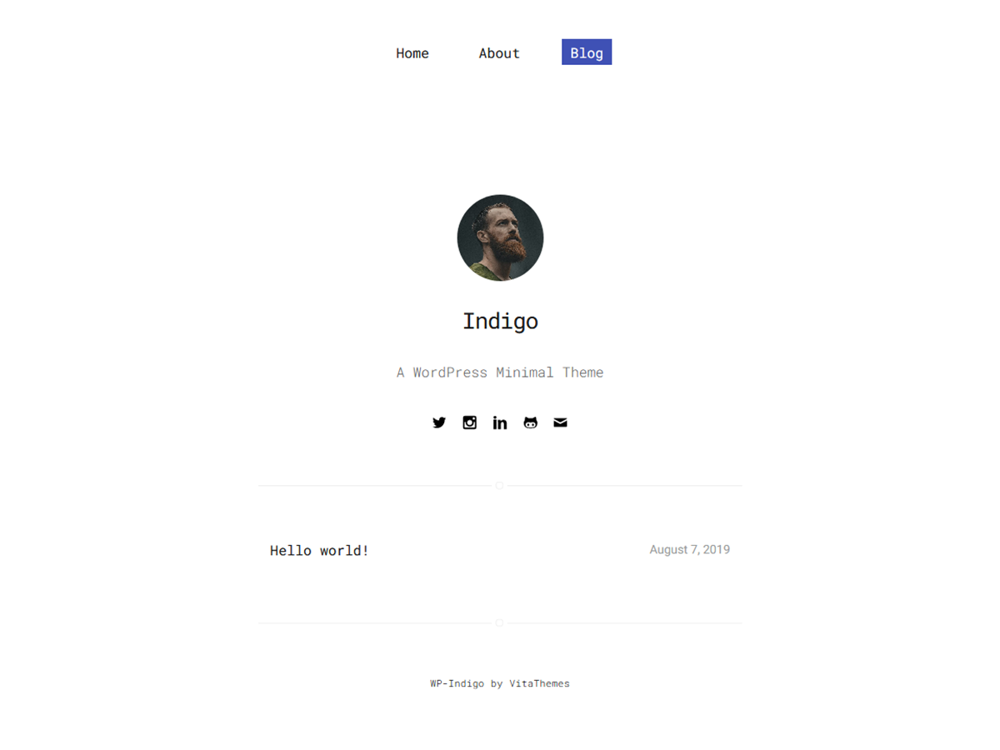

# WP-Indigo - [Demo](https://demo.vitathemes.com/indigo/) | [Download](https://wordpress.org/themes/wp-indigo/)
WP-Indigo is a WordPress minimal & Fast-loading theme for people who want to have a simple blog & introduce themselves.

It's based on the [indigo](https://github.com/sergiokopplin/indigo), that originally builds for Jekyll.



## Features
* No additional JS
* Sass for stylesheets
* Compatible with [Contact Form 7](https://wordpress.org/plugins/contact-form-7/)
* Fast & lightweight (Google Speed: 99/100)
* Theme options built directly into WordPress native live theme customizer
* Responsive design
* Cross-browser compatibility
* Custom Google WebFonts
* Child themes support
* Developer friendly extendable code
* Translation ready (with .POT files included)
* Right-to-left (RTL) languages support
* SEO optimized
* GNU GPL version 2.0 licensed
* …and much more

See a working example at [demo.vitathemes.com/indigo](https://demo.vitathemes.com/indigo/).

## Theme installation
1. Simply install as a normal WordPress theme and activate.
2. Make a page called Home and set the Page template to Home.
3. Make another page called Blog and set the Page template to Blog.
4. In your admin panel, navigate to `Settings > Reading`.
5. Select `A static page (select below)` and select the pages created.
6. In your admin panel, navigate to `Appearance > Customize`.
7. Put the finishing touches on your website by adding a logo, typography settings, custom colors and etc.

## Theme structure

```shell
themes/wp-indigo/         # → Root of your theme
├── assets/               # → Assets files
│   ├── css/              # → Compiled CSS file
│   ├── images/           # → Theme images
│   └── sass/             # → Theme scss files
├── languages/            # → Theme Language files
├── template-parts/       # → Theme Part files (Include)
├── node_modules/         # → Node.js packages
├── vendor/               # → Third Party Packages (Managed by Composer, Currently we use [Kirki Framework](https://github.com/aristath/kirki) for customizer)
├── package.json          # → Node.js dependencies and scripts
├── inc/                  # → Theme functions
│   ├── classes/          # → Custom PHP classes
│   ├── kirki/            # → Kirki Customization framework
│   ├── customizer.php    # → All codes related to WordPress Customizer (We use Kirki Framework)
│   ├── template-functions.php    # → Custom template tags & tweaks
│   └── setup.php         # → Theme Setup
└── page-templates/       # → Page Templates
```

## Theme setup

Edit `inc/setup.php` to enable or disable theme features, setup navigation menus, post thumbnail sizes, and sidebars.

## Theme development

* Run `npm install` from the theme directory to install dependencies
* Update `gulpfile.js` settings:
  * `proxy` should reflect your local development hostname
* Run `gulp` for build the distribution

## Contributing

Contributions are welcome from everyone. We have [contributing guidelines](CONTRIBUTING.md) to help you get started.

## Changelog

See the [Changelog](CHANGELOG.md)

## License

This Theme based on [indigo](https://github.com/sergiokopplin/indigo) by [sergiokopplin](https://github.com/sergiokopplin)

WP-Indigo is licensed under [GNU GPL](LICENSE).